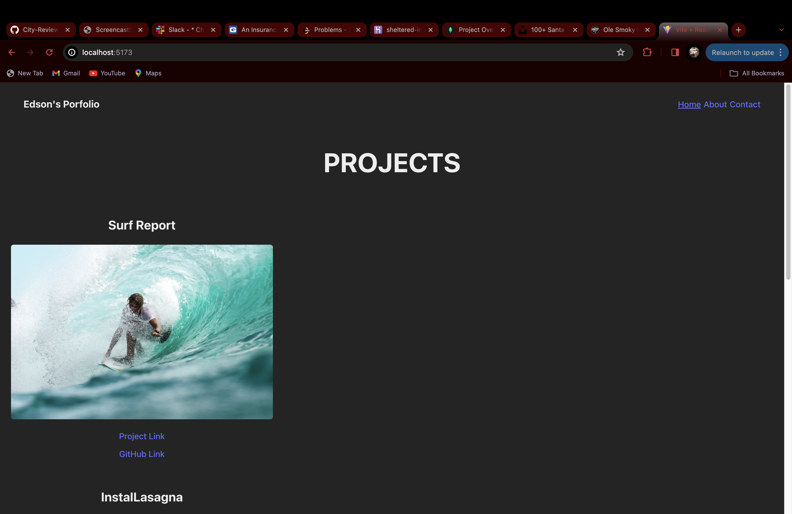

# React Portfolio

Welcome to my React portfolio! This project showcases my skills and projects as a web developer. With this portfolio, I aim to present myself effectively to potential employers, clients, and collaborators in the web development community.

## Features

- \*\*Responsive Design\*\*: The portfolio is designed to be fully responsive, ensuring a seamless experience across various devices and screen sizes.

- \*\*Contact Form\*\*: Includes a contact form to allow visitors to reach out to me easily for inquiries, collaboration opportunities, or feedback.

- \*\*Tech Stack\*\*: Built with React, this portfolio utilizes modern web development technologies and best practices.

## Deployment

This portfolio can be easily deployed to Netlify. 

## License

This project is licensed under the MIT License - see the \[LICENSE\](LICENSE) file for details.

## Screenshot
